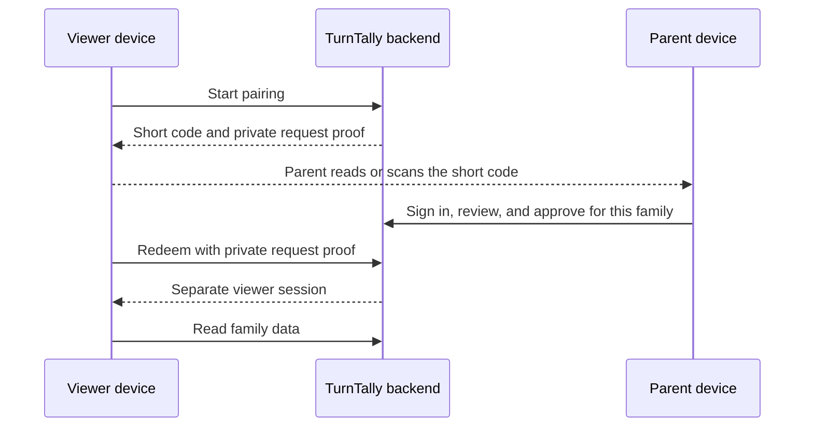

# Viewer device enrollment

Milestone 4, steps 1–2. Design approved September 7, 2026; implementation added September 8 UTC (September 7 local time). The migration, Edge Function, parent/device screens, and automated tests are in the repository. The real Auth integration check passed in [CI run 34175990406](https://github.com/foxnei1/turn-tally/actions/runs/34175990406). **Not deployed:** two-browser acceptance and deployment verification remain before updating the live pilot. See the [release instructions](viewer-enrollment-release.md).

## Purpose and decisions

A parent can give a child's browser or a shared family tablet access to assignments, history, explanations, and absence plans without collecting a child email address. Device access is always view-only. Only a currently authorized family administrator can enroll or revoke devices; adult-child editors cannot administer access.

| Decision | First version | Status |
|---|---|---|
| Pairing | Device displays a short code; parent approves from a separate signed-in device | Approved; implemented |
| Supported devices | Personal devices and a shared family tablet | Approved; implemented |
| Pairing expiry | 10 minutes from request creation; server clock is authoritative | Approved; implemented |
| Ongoing enrollment | No scheduled reapproval; re-pair after revocation, disconnection, or loss of the stored session | Approved; implemented |
| Shared-device adult use | Parent uses their own device for edits; switching accounts on the viewer device disconnects it first | Approved; implemented |
| First delivery | Connected viewing; durable offline viewing follows in milestone 4, step 4 | Existing milestone sequence |

An enrollment belongs to a browser profile or installed app, not a hardware identity. Another browser on the same phone needs its own pairing. Clearing browser data or losing a refresh session requires pairing again; no child password-recovery flow is introduced.

## Family-facing flow

1. On the device to be enrolled, open TurnTally and choose **Use as a viewer**. No family information is shown yet.
2. Choose **Get a pairing code**. Show an eight-character code grouped as `ABCD-EFGH`, an expiry countdown, and instructions to have a parent approve it. The first implementation uses manual entry; the optional QR shortcut is deferred.
3. On their own signed-in device, the parent opens **Family → Devices → Add viewer device** and enters the code. Scanning the QR may take them here after sign-in, but must not approve automatically.
4. The parent compares the displayed code with the target device, selects **Personal device** or **Shared family device**, and gives it a recognizable name such as "Kitchen tablet". Personal devices link to an existing active family member; shared devices belong to the household without impersonating a child or parent.
5. Show the family, selected person or shared purpose, device name, and **View only** in an explicit approval summary. The parent chooses **Approve device** or **Cancel**. Possession of a code alone grants no access.
6. The original device exchanges its pending request for its own viewer session. Display **Connected — View only** and load the shared family. No parent session or credentials are transferred.
7. Expired, rejected, canceled, or already-used requests show a clear reason and **Get a new code**. A failed pairing does not create a family, import a backup, or change turns.

This is an application pairing flow inspired by the separation between a public user code and private device proof in [RFC 8628](https://www.rfc-editor.org/rfc/rfc8628.html). It is not a claim that Supabase supplies an RFC 8628 endpoint for this feature.

## What a viewer can see and do

All viewer devices can read the family's assignments, activity history, explanations, and absence plans, matching the existing role contract. Personal linkage is useful for identifying and revoking a child's devices; it does not promise that siblings' schedules are hidden. A shared tablet uses a device label and **Family viewer**, with no child profile selector.

Viewers cannot correct outcomes, report absences, edit activities, manage people or devices, export/import backups, reset data, or approve another pairing. The server enforces these restrictions even if interface controls or requests are altered. Automatic local calculation of assignments does not authorize a viewer to persist events.

A person's later promotion to editor or administrator never upgrades an existing viewer device. Adult editing requires a separately provisioned adult sign-in. Enrolling an adult's device as a viewer likewise does not grant editing rights.

## Device management and access lifetime

The parent's Devices screen lists the chosen name, personal/shared purpose, linked person where applicable, enrollment time, last successful contact, and active/revoked state. Last contact is a coarse connectivity indicator, not location or detailed usage tracking. Renaming a device does not change its identity or permissions.

**Revoke device** removes that enrollment's household access. It does not remove the family member, history, or other devices. Re-pairing after revocation creates a new enrollment; old tokens never regain access. Deactivating a family member revokes their personal viewer enrollments as part of the same authorized family operation. Reactivation does not silently restore them. Shared devices remain household-managed and are not disabled merely because the approving parent later changes roles.

Enrollment has no fixed calendar expiry. Normal Supabase session loss, explicit disconnection, revoked membership, or cleared browser storage can still require re-pairing. Supabase documents default session persistence and the plan restrictions for built-in time limits in its [session guide](https://supabase.com/docs/guides/auth/sessions).

Every new server request checks current device authorization. Revocation prevents subsequent authorized reads immediately after its transaction commits, including requests made with a still-unexpired JWT. An already-delivered response or visible screen cannot be remotely erased. The connected viewer should recheck access at least every 60 seconds while visible, on focus, and on reconnect, then discard displayed/cached family state when denied. This is an authorization check; it need not refresh an open family view silently.

Durable offline viewing is not included in step 2. Its later implementation must establish a bounded cache lifetime and explain that an offline device cannot discover revocation until reconnecting. Do not describe a remote wipe or immediate offline revocation as guaranteed.

## Shared devices and adult accounts

A shared tablet stays in view-only mode. Parents use their personal signed-in devices to edit. No stored parent password, local adult profile picker, PIN-based role elevation, or automatic return to an old adult session is provided.

If a parent chooses **Sign in as an adult** on a viewer device, explain that it will disconnect viewer access, require connectivity to revoke that enrollment and end its session, clear local family state, and then show the normal adult sign-in form. Completing adult sign-in grants only that adult account's actual permissions. It does not upgrade the revoked viewer identity. Returning the browser to viewer use requires ending the adult session and pairing again. If disconnection fails, remain in viewer mode and offer retry; do not leave an adult login behind a viewer-looking screen.

## Pairing and authorization boundaries

The code shown to the parent is a locator, not a session credential. The requesting browser also holds a separate cryptographically random 256-bit proof. Store only hashes of pairing secrets on the server. Do not place private device proof, Auth tokens, household data, or internal sign-in links in QR codes, URLs, analytics, logs, error messages, or browser history. Responses carrying pairing/session material use `Cache-Control: no-store`.

Unauthenticated endpoints may create a short-lived pending request or check/redeem that request with its private proof. They cannot create an Auth account or access a household before parent approval. Reveal no family or person names while waiting. Approval derives its family and authority from the parent's verified session and current stored membership, never from a client-supplied role or `user_metadata`.

Implemented limits: one pending request per tab, 10 starts per source bucket per 15 minutes, 10 code operations (including successful lookup and approval) per administrator per 15 minutes, and polling no faster than every five seconds with client backoff. The default uses one conservative shared source bucket: no forwarded IP header is trusted automatically. An operator may configure `VIEWER_TRUSTED_IP_HEADER` only after verifying that the gateway overwrites it. A separate global quota allows at most 100 starts per 15 minutes, 100 live requests, and 5,000 retained requests. All counters and transitions are serialized in PostgreSQL across Edge instances. Code hashes have a unique constraint.

Cleanup runs on device-service traffic, processing at most five abandoned identities and 100 old requests/counters per call. Expired and canceled accounts never have active membership. Reserved Auth UUIDs allow deletion even when a creation response is lost; retained tombstones retry failed deletion after 30 minutes. Completed requests and successfully cleaned tombstones age out after seven days. An idle deployment does not run background cleanup; cleanup resumes with traffic. Failed deletions retain their records and eventually cause new starts to fail closed at the total cap.

Approval and redemption have explicit state transitions: `pending → approved → provisioning → issued → claimed`, with terminal `expired`, `denied`, and `canceled` states. Redemption checks the original proof, unexpired approval, initialized family, current administrator authority, and active personal linkage. A 60-second provisioning lease prevents a second provisioning attempt. Membership is created only when the requester acknowledges receipt with both its new verified Auth session and the original proof.

The pending proof and a delivered provisional session are retained only in the tab's session storage, then removed after the normal Auth session is stored. A lost activation response can safely retry acknowledgement with that same session; it cannot create another enrollment or revive a revoked one. If the session issuance response itself is lost, the requester has no session to acknowledge and must start again. Abandoned provisioning never grants family access.

## Fit with the current backend

The existing `viewer_only` membership cap and current-membership checks are useful foundations. Each enrollment needs its own Auth identity so revoking one device cannot revoke a sibling's device or the parent's normal account. Device names, purpose, optional person linkage, and revocation state are access records rather than rotation events and must not be accepted from backup imports.

Personal enrollments can map to the existing member ID. Shared enrollments require an explicit household-viewer identity: the current load RPC and React app assume every signed-in identity has a person ID. Step 2 must update that assumption deliberately and render device identity separately, while preserving the existing adult role checks. Do not create fake roster members or assign the parent as the displayed actor to make shared tablets work.

A server-side Supabase Edge Function coordinates pairing and Auth administration; Cloudflare continues serving static app files. It uses an operator-created Auth identity with a reserved UUID and an opaque `UUID@viewer.turntally.invalid` identifier, an administrator-generated one-time sign-in token, and redemption bound to the private request proof. The child supplies no email or password. Public signup and anonymous sign-in stay disabled.

Supabase documents server-only [Auth user creation](https://supabase.com/docs/reference/javascript/auth-admin-createuser), [link/OTP generation](https://supabase.com/docs/reference/javascript/auth-admin-generatelink), and [token-hash verification](https://supabase.com/docs/reference/javascript/auth-verifyotp). TurnTally's integration passed against an isolated Docker-backed Supabase stack in [CI run 34175990406](https://github.com/foxnei1/turn-tally/actions/runs/34175990406): public signup was rejected, enrollment sent no email, the intended identifier format worked, and email/password/metadata changes plus session refresh did not remove the viewer cap or restore revoked access. This does not replace hosted two-browser acceptance.

Privileged Auth credentials stay in server-managed secrets. The coordinator verifies the parent and performs narrow, transactional authorization operations. Auth provisioning is external to the database transaction, so the lease/cleanup behavior above is required. A lost or failed provisioning operation must not grant access. Revoke membership before attempting Auth session cleanup, because revoking refresh tokens alone does not immediately invalidate an issued access token. See [Supabase sign-out behavior](https://supabase.com/docs/guides/auth/signout).

## Step 2 acceptance checks

- A parent pairs a personal device and, if selected for the first version, a shared tablet without a child email or password. Neither receives the parent's session.
- An editor, viewer, unprovisioned user, or revoked administrator cannot approve or manage enrollments, including through direct API calls.
- Missing/guessed proof, expired codes, code reuse, concurrent redemption, canceled approval, and parent demotion during pairing produce no unauthorized session.
- Both device types load only the approved household. Every existing mutation is rejected for viewers, including direct RPC calls and forged role fields.
- Revoking one device leaves other devices and the parent's account working. Old access and refresh tokens cannot restore household access. Personal-member deactivation revokes linked viewers; reactivation does not revive them.
- Browser refresh preserves an enrolled session. Cleared storage or session loss returns to pairing. Pairing expiry never changes an already-enrolled device's lifetime.
- A shared tablet never displays an adult session as a viewer session. Adult account switching follows the explicit disconnect/sign-in flow.
- Pairing does not overwrite family data or alter household revision/history. Tests cover provisioning failure and lost redemption responses without active orphaned access.
- Tokens and pairing proofs do not appear in logs, static bundles, URLs, backups, or repository files. Live public signup remains disabled.

Step 1 is approved and step 2 is committed with passing browser, coordinator, database, and native Auth CI checks. No live schema, Auth settings, accounts, or deployed app behavior changed during implementation or CI testing.
